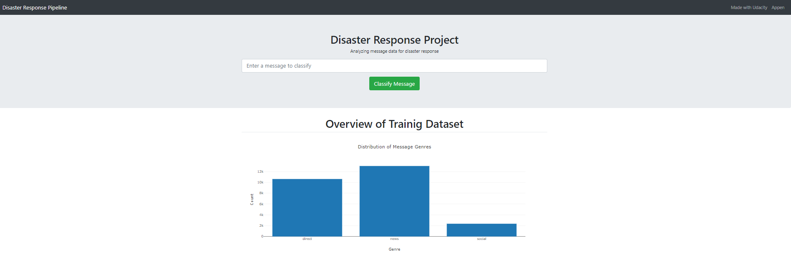
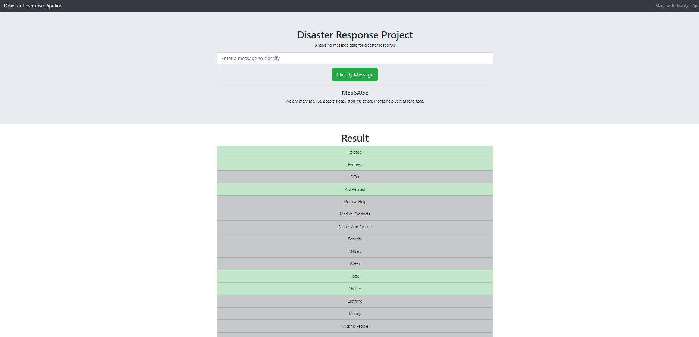

# Disaster Response Pipeline Project
## Description
This Project is part of Data Science Nanodegree Program by Udacity in collaboration with Figure Eight. The initial dataset contains pre-labelled tweet and messages from real-life disaster. The aim of the project is to build a Natural Language Processing tool that categorize messages.

## The Project is divided in the following Sections:

Data Processing, ETL Pipeline to extract data from source, clean data and save them in a proper databse structure
Machine Learning Pipeline to train a model able to classify text message in categories
Web App to show model results in real time.
### Files:
#### Data:

We have the disaster category and message csv files, that contain the data on which the model was trained in.
We have process_data.py which has the ETL pipeline.
We have the database created 'DisasterResponse.db', this is the output of running the ETL pipeline.
#### Models:

We have the 'train_classifier.py' from where the ML pipeline is contained.
We have the 'starting_verb_extractor.py' which is a class used for expanding the model creating a starting verb extractor as a feature.
#### App:
We have 'run.py' which is used as the main file for starting the web app.
 

## Instructions: 
1. Run the following commands in the project's root directory to set up your database and model.

    - To run ETL pipeline that cleans data and stores in database
        `python data/process_data.py data/disaster_messages.csv data/disaster_categories.csv data/DisasterResponse.db`
    - To run ML pipeline that trains classifier and saves
        `python models/train_classifier.py data/DisasterResponse.db models/classifier.pkl`

2. Go to `app` directory: `cd app`

3. Run your web app: `python run.py`

4. Click the `PREVIEW` button to open the homepage

5. Go to http://0.0.0.0:3001/

### Clone this GIT repository:
https://github.com/kinaMouelouel/Project_Disaster_Response_Pipeline
Run the following commands in the project's root directory to set up your database and model.

To run ETL pipeline that cleans data and stores in database, delete the DisasterResponse.db file if it has been created before and run the following code: `python data/process_data.py data/disaster_messages.csv data/disaster_categories.csv data/DisasterResponse.db``
To run ML pipeline that trains classifier and saves: `python models/train_classifier.py data/DisasterResponse.db models/classifier.pkl``
Run the following command in the app's directory to run your web app: `python run.py``

Go to http://0.0.0.0:3001/